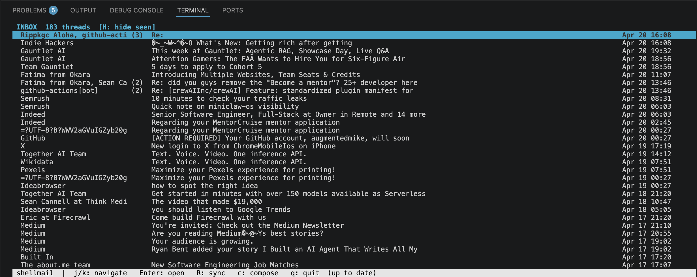
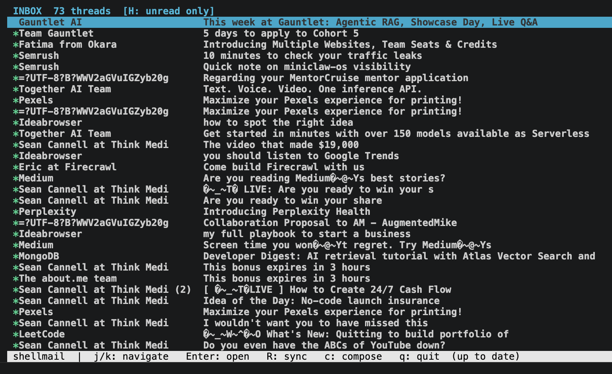

# shellmail

**Email in the terminal. No Electron. No browser. No bullshit.**

A fast, keyboard-driven IMAP email client written in C. Threads, filters, full TLS — all in a ncurses UI that opens instantly and stays out of your way.



---

## Why

Every email client is either a web app pretending to be native or a native app pretending to be fast. `shellmail` is neither. It's ~3,000 lines of C that connects to your IMAP server, caches everything in SQLite, and renders in your terminal.

No runtime. No VM. No framework. Starts in under a second.

---

## Features

- **Thread view** — conversations grouped and sorted by latest message
- **Background sync** — IMAP fetch runs on a separate thread while you navigate
- **Local cache** — SQLite-backed, survives restarts, loads instantly
- **Hide seen** — `H` filters the list to unread only
- **Vim-style filter rules** — press `:` to define `filter from "x" -> Folder`, moves all matching mail and creates the folder on the server
- **Mark all read** — `M` sends `STORE 1:* +FLAGS (\Seen)` to the server and updates the local cache
- **TLS** — mbedTLS 4.x, no OpenSSL dependency
- **Compose + reply** — SMTP send via TLS



---

## Keys

| Key | Action |
|-----|--------|
| `j` / `k` | Navigate threads |
| `Enter` | Open thread |
| `H` | Toggle hide-seen filter |
| `M` | Mark all as read (server + cache) |
| `:` | Open filter command bar |
| `R` | Force sync |
| `c` | Compose new message |
| `r` | Reply (in reader) |
| `ESC` | Back to list |
| `q` | Quit |

### Filter syntax

```
filter from "newsletter@example.com" -> Newsletters
filter subject "invoice" -> Finance
```

Press `:` with a thread selected — the command bar pre-fills with the sender's address.

---

## Use with tmux (stay in the terminal)

The whole point. Run shellmail in a split pane alongside Claude Code, vim, or whatever you're working in — check email without touching the mouse or leaving the terminal.

**Quick split:**

```sh
# New pane to the right with shellmail
tmux split-window -h './shellmail'

# Or below
tmux split-window -v './shellmail'
```

**Switch between panes:** `Ctrl-b` then an arrow key (or `Ctrl-b o` to cycle).

**Full setup — open shellmail in its own tmux window:**

```sh
tmux new-window -n mail './shellmail'
```

Switch to it with `` Ctrl-b ` `` (if you've named it) or `Ctrl-b n` / `Ctrl-b p`.

**Recommended `.tmux.conf` binding:**

```sh
# Ctrl-b e — toggle shellmail pane
bind e split-window -h -l 40% './shellmail'
```

With this, `Ctrl-b e` opens shellmail in a 40%-wide right pane. Press `q` to close it and return to your editor.

**With screen:**

```sh
screen -S mail ./shellmail   # start in named session
screen -r mail               # reattach from anywhere
```

Or use `Ctrl-a |` to split vertically inside an existing screen session, then `Ctrl-a tab` to switch focus and run `./shellmail` in the new region.

---

## Build

**Dependencies** (macOS via Homebrew):

```sh
brew install mbedtls ncurses sqlite
```

**Build:**

```sh
make
```

Output binary: `./shellmail`

---

## Config

Copy `config.yaml.example` to `config.yaml`:

```yaml
imap_server: imap.gmail.com
imap_port: "993"
smtp_server: smtp.gmail.com
smtp_port: "465"
username: you@gmail.com
password: your-app-password
```

For Gmail, use an [App Password](https://myaccount.google.com/apppasswords) — not your account password.

---

## Architecture

```
src/
  imap/       IMAP4rev1 client (TLS, UID FETCH, FLAGS, COPY/EXPUNGE)
  smtp/       SMTP send over TLS
  cache/      SQLite layer (headers, bodies, flags, filters)
  sync/       Background sync thread (pthread + cond var)
  core/       Message types, thread grouping, app state
  ui/         ncurses panes (list, reader, composer, command bar)
  net/        TLS session management (mbedTLS)
```

Everything is single-threaded except the sync worker, which communicates via atomic flags and a mutex/condvar — no shared mutable state between the sync thread and the UI.

---

## Status

Daily driver. Works with Gmail and any standard IMAP server. Written for macOS, should build on Linux with minor Makefile adjustments.

---

Built by [@augmentedmike](https://github.com/augmentedmike)
